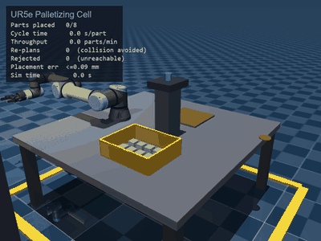
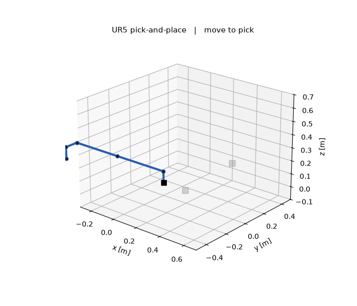

# Robot Arm IK

[](https://github.com/MKamel7/robot-arm-ik/actions/workflows/ci.yml)

Inverse kinematics and trajectory planning for a 6-DOF serial manipulator (the Universal Robots UR5/UR5e), written from the kinematics up in NumPy. Given a target pose for the tool, the planner finds the joint angles that reach it, plans a smooth timed motion to get there, and animates the whole thing in 3D.



*A UR5e palletizing cell, rendered in the [MuJoCo](https://mujoco.org) physics engine (`apps/palletizing_cell.py`): the robot transfers parts from a supply bin into a pallet grid with a Robotiq 2F-85 gripper, while a heads-up display reports the production metrics an automation engineer cares about (cycle time, throughput, placement accuracy). Every joint angle comes from this library: the UR5e forward kinematics is cross-validated against the MuJoCo model to ~1 mm, and the placement accuracy shown is the IK solver's own residual. A single pick-and-place (`apps/pick_and_place_mujoco.py`) and a dependency-light matplotlib version (`apps/pick_and_place.py`, below) also ship.*



## What it does

Four independent pieces, each a distinct capability:

1. **Forward kinematics** (`src/armik/robot.py`). The arm is defined by standard Denavit-Hartenberg parameters (real, manufacturer-published numbers). `SerialArm.fk(q)` composes the per-link homogeneous transforms to give the tool pose for any joint configuration. Both `SerialArm.ur5()` (the default) and `SerialArm.ur5e()` are provided; the UR5e FK is cross-validated against the MuJoCo Menagerie model to ~1 mm with an identity joint mapping.

2. **Geometric Jacobian** (`SerialArm.jacobian(q)`). Maps joint velocities to the tool's spatial velocity, `[v; omega] = J(q) q_dot`. Its conditioning reveals singular configurations. The test suite verifies the analytic Jacobian against a finite-difference of forward kinematics, and confirms that the UR5's home pose is genuinely singular (rank drops below 6).

3. **Inverse kinematics** (`src/armik/ik.py`). The hard part. A numerical solver using **damped least squares**:

   ```
   dq = J^T (J J^T + lambda^2 I)^-1 e
   ```

   where `e` is the 6D pose error (position, plus orientation as a rotation vector). The damping term keeps the joint step bounded near singularities, where a plain pseudo-inverse would demand near-infinite joint speeds and blow up. Per-iteration step clamping keeps the linearisation honest, and each iterate is clamped to the joint limits. The solver reports whether it converged and the residual position and orientation error.

3b. **Closed-form inverse kinematics** (`src/armik/analytical.py`). `analytical_ik(arm, T)` returns *all* solutions in closed form: a generic reachable pose has eight (two shoulder, two elbow, two wrist branches), and the solver drops branches that are genuinely unreachable rather than faking them. This is both a capability (no seed, no iteration, every branch at once) and the strongest possible correctness check: over 2000 random poses, every analytic solution reproduces the target pose through forward kinematics to ~1e-13, and the numerical solver is verified to land on one of these branches.

4. **Trajectory planning** (`src/armik/trajectory.py`). A synchronised trapezoidal profile: all joints move together along a straight line in joint space, driven by a single time-scaling `s(t)` whose velocity and acceleration limits are chosen so no joint exceeds its bounds. The motion starts and ends at rest with a clean trapezoidal velocity profile. A Cartesian straight-line planner is also included (linear position, SLERP orientation, IK at each step).

The pick-and-place demo (`apps/pick_and_place.py`) ties it together: reach to a pick location, grasp, carry, release, and return home, with the gripper state shown on the tool tip.

## Photoreal demos (MuJoCo)

Two optional demos render the kinematics in the [MuJoCo](https://mujoco.org) physics engine with a real UR5e and a Robotiq 2F-85 gripper. In both, armik does all the kinematics (`SerialArm.ur5e()` forward kinematics + damped-least-squares IK solve each waypoint, `joint_trajectory` builds the timed motion) and MuJoCo only renders the result and animates the gripper.

- **`apps/palletizing_cell.py`** (hero animation above) — an industrial palletizing cell that goes past a happy-path animation. It does **collision-aware routing** (a machine fixture stands between the bin and the pallet; the planner checks the direct path with MuJoCo contact queries and re-routes up-and-over when it is blocked), **multi-layer palletizing** (parts stack into a 2x2x2 pallet), and **failure handling** (one requested slot is outside the arm's reach; a reachability check rejects it on screen and the cell carries on). A heads-up display reports parts placed, cycle time, throughput, re-plans, rejections, and placement accuracy (the IK solver's own residual). This mirrors real end-of-line automation and intralogistics work.
- **`apps/pick_and_place_mujoco.py`** — a single pick-and-place, the same task as the matplotlib demo.

The UR5e and gripper models come from the [MuJoCo Menagerie](https://github.com/google-deepmind/mujoco_menagerie), vendored under `assets/` with their licenses (see `assets/ATTRIBUTION.md`). These are optional extras, so the core library stays pure-NumPy.

## Run it

```bash
uv run --group dev pytest                        # 24 tests: FK, Jacobian, IK, analytic IK, trajectory, UR5e
uv run --group dev python apps/pick_and_place.py --save   # matplotlib animation -> docs/pick_and_place.gif

uv run --group sim python apps/palletizing_cell.py --save         # the palletizing cell GIF
uv run --group sim python apps/pick_and_place_mujoco.py --save     # the single pick-and-place GIF
```

(or the classic path: `pip install numpy matplotlib pytest`, then `python apps/pick_and_place.py`; add `pip install mujoco imageio pillow` for the MuJoCo demos.)

## Why damped least squares

The clean way to invert the Jacobian is the Moore-Penrose pseudo-inverse, `dq = J^+ e`. It works right up until the arm approaches a singularity, where the Jacobian loses rank, `J J^T` becomes ill-conditioned, and the commanded joint velocities explode. Damped least squares trades a small amount of tracking accuracy for stability: the `lambda^2 I` term bounds the step no matter how singular the configuration. The UR5's fully-extended home pose is a real singularity, so the solver is tested seeded from exactly there and required to stay finite and make progress, not diverge.

## Layout

```
src/armik/
  robot.py        DH model, forward kinematics, geometric Jacobian
  rotations.py    rotation-vector <-> matrix, SLERP (robust at 0 and pi)
  ik.py           damped-least-squares IK, manipulability measure
  analytical.py   closed-form UR5 IK (all 8 branches)
  trajectory.py   synchronised trapezoidal + Cartesian straight-line
apps/
  pick_and_place.py         matplotlib 3D animated demo (NumPy only)
  pick_and_place_mujoco.py  photoreal MuJoCo pick-and-place (UR5e + Robotiq 2F-85)
  palletizing_cell.py       industrial palletizing cell with a production-metrics HUD
assets/                     vendored MuJoCo Menagerie models (UR5e, 2F-85) + licenses
tests/
  test_kinematics.py     FK validity, Jacobian vs finite-difference, singularity
  test_ik.py             round-trip accuracy, stability near singularity
  test_analytical_ik.py  every branch reaches the pose, 8-branch count, numeric agrees
  test_trajectory.py     boundary conditions, velocity limits, synchronisation
  test_ur5e.py           UR5e FK golden (vs MuJoCo), IK round-trip
```

## License

MIT
