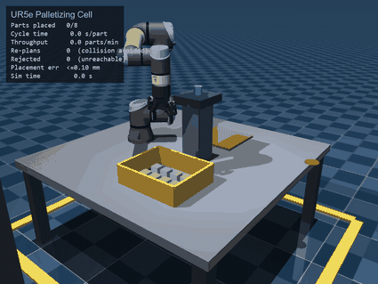
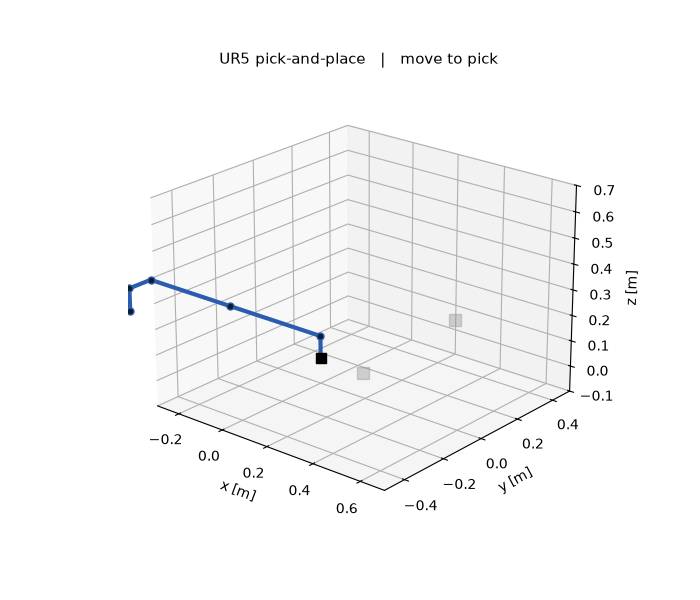
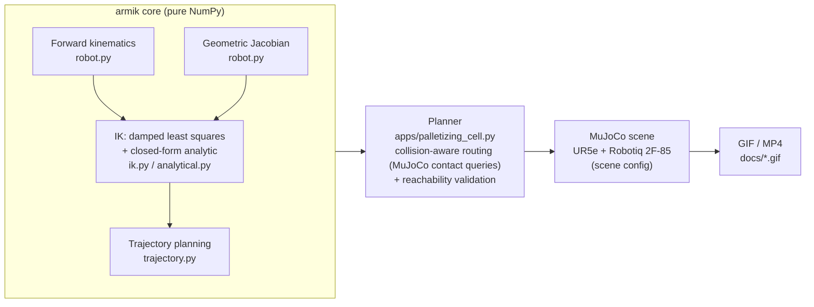
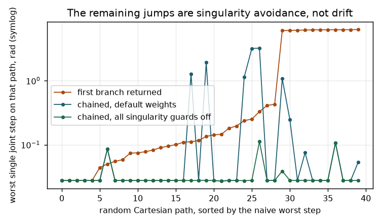
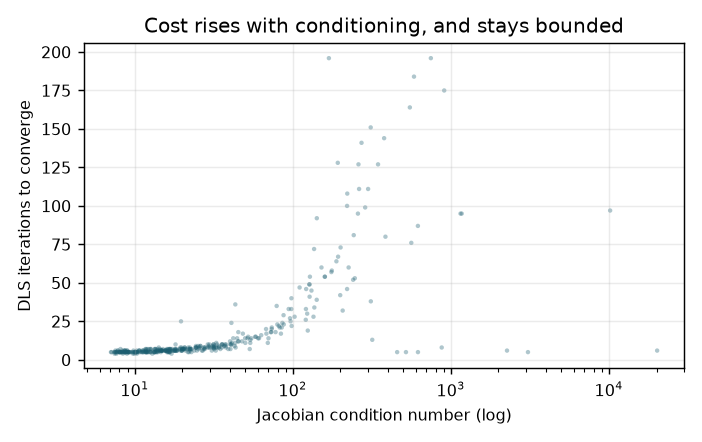
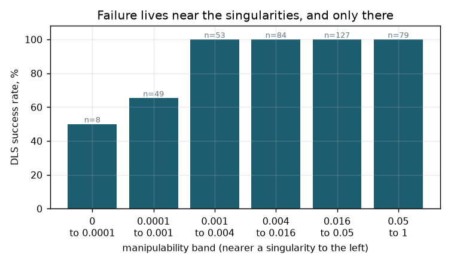

# Robot Arm IK

[](https://github.com/MKamel7/robot-arm-ik/actions/workflows/ci.yml)

Inverse kinematics and trajectory planning for a 6-DOF serial manipulator (the Universal Robots UR5/UR5e), written from the kinematics up in NumPy. Given a target pose for the tool, the planner finds the joint angles that reach it, plans a smooth timed motion to get there, and animates the whole thing in 3D.



*A UR5e palletizing cell, rendered in the [MuJoCo](https://mujoco.org) physics engine (`apps/palletizing_cell.py`): the robot transfers parts from a supply bin into a pallet grid with a Robotiq 2F-85 gripper, while a heads-up display reports the production metrics an automation engineer cares about (cycle time, throughput, placement accuracy). Every joint angle comes from this library: the UR5e forward kinematics is cross-validated against the MuJoCo model in the test suite, and agrees to 1.5 mm worst case, and the placement accuracy shown is the IK solver's own residual. A single pick-and-place (`apps/pick_and_place_mujoco.py`) and a dependency-light matplotlib version (`apps/pick_and_place.py`, below) also ship.*



## What it does

Four independent pieces, each a distinct capability:

1. **Forward kinematics** (`src/armik/robot.py`). The arm is defined by standard Denavit-Hartenberg parameters (real, manufacturer-published numbers). `SerialArm.fk(q)` composes the per-link homogeneous transforms to give the tool pose for any joint configuration. Both `SerialArm.ur5()` (the default) and `SerialArm.ur5e()` are provided; the UR5e FK is cross-validated against the MuJoCo Menagerie model with an identity joint mapping, in `tests/test_ur5e_mujoco.py`: position agrees to **1.5 mm worst case and 0.98 mm mean** over 5000 random configurations, orientation to 4e-6 degrees. The residual is not an error in either model, it is the Menagerie XML rounding the link lengths to the millimetre where the DH table uses the datasheet values to a tenth.

2. **Geometric Jacobian** (`SerialArm.jacobian(q)`). Maps joint velocities to the tool's spatial velocity, `[v; omega] = J(q) q_dot`. Its conditioning reveals singular configurations. The test suite verifies the analytic Jacobian against a finite-difference of forward kinematics, and confirms that the UR5's home pose is genuinely singular (rank drops below 6).

3. **Inverse kinematics** (`src/armik/ik.py`). The hard part. A numerical solver using **damped least squares**:

   ```
   dq = J^T (J J^T + lambda^2 I)^-1 e
   ```

   where `e` is the 6D pose error (position, plus orientation as a rotation vector). The damping term keeps the joint step bounded near singularities, where a plain pseudo-inverse would demand near-infinite joint speeds and blow up. Per-iteration step clamping keeps the linearisation honest, and each iterate is clamped to the joint limits. The solver reports whether it converged and the residual position and orientation error.

3b. **Closed-form inverse kinematics** (`src/armik/analytical.py`). `analytical_ik(arm, T)` returns *all* solutions in closed form: a generic reachable pose has eight (two shoulder, two elbow, two wrist branches), and the solver drops branches that are genuinely unreachable rather than faking them. This is both a capability (no seed, no iteration, every branch at once) and the strongest possible correctness check: over 2000 random poses, every analytic solution reproduces the target pose through forward kinematics to ~1e-13, and the numerical solver is verified to land on one of these branches.

4. **Trajectory planning** (`src/armik/trajectory.py`). A synchronised trapezoidal profile: all joints move together along a straight line in joint space, driven by a single time-scaling `s(t)` whose velocity and acceleration limits are chosen so no joint exceeds its bounds. The motion starts and ends at rest with a clean trapezoidal velocity profile. A Cartesian straight-line planner is also included (linear position, SLERP orientation, IK at each step).

The pick-and-place demo (`apps/pick_and_place.py`) ties it together: reach to a pick location, grasp, carry, release, and return home, with the gripper state shown on the tool tip.

## Architecture


```mermaid
flowchart LR
    subgraph CORE["armik core (pure NumPy)"]
        direction TB
        FK["Forward kinematics<br/>robot.py"]
        JAC["Geometric Jacobian<br/>robot.py"]
        IK["IK: damped least squares<br/>+ closed-form analytic<br/>ik.py / analytical.py"]
        TRAJ["Trajectory planning<br/>trajectory.py"]
        FK --> IK
        JAC --> IK
        IK --> TRAJ
    end

    PLANNER["Planner<br/>apps/palletizing_cell.py<br/>collision-aware routing (MuJoCo contact queries)<br/>+ reachability validation"]
    SCENE["MuJoCo scene<br/>UR5e + Robotiq 2F-85<br/>(scene config)"]
    OUT["GIF / MP4<br/>docs/*.gif"]

    CORE --> PLANNER --> SCENE --> OUT
```

armik never touches MuJoCo directly: it solves poses and timing in plain NumPy, and the Planner is the only place that queries MuJoCo (contact checks for re-routing, forward kinematics for reachability) before handing the resulting joint path to the scene for rendering. *Scene parameters (table height, grid layout, home pose, and the like) are being consolidated out of inline constants into a single scene config, so the same Planner/scene pipeline can be re-targeted without editing code.*

## Photoreal demos (MuJoCo)

Two optional demos render the kinematics in the [MuJoCo](https://mujoco.org) physics engine with a real UR5e and a Robotiq 2F-85 gripper. In both, armik does all the kinematics (`SerialArm.ur5e()` forward kinematics + damped-least-squares IK solve each waypoint, `joint_trajectory` builds the timed motion) and MuJoCo only renders the result and animates the gripper.

- **`apps/palletizing_cell.py`** (hero animation above) — an industrial palletizing cell that goes past a happy-path animation. It does **collision-aware routing** (a machine fixture stands between the bin and the pallet; the planner checks the direct path with MuJoCo contact queries and re-routes up-and-over when it is blocked), **multi-layer palletizing** (parts stack into a 2x2x2 pallet), and **failure handling** (one requested slot is outside the arm's reach; a reachability check rejects it on screen and the cell carries on). A heads-up display reports parts placed, cycle time, throughput, re-plans, rejections, and placement accuracy (the IK solver's own residual). This mirrors real end-of-line automation and intralogistics work.
- **`apps/pick_and_place_mujoco.py`** — a single pick-and-place, the same task as the matplotlib demo.

The UR5e and gripper models come from the [MuJoCo Menagerie](https://github.com/google-deepmind/mujoco_menagerie), vendored under `assets/` with their licenses (see `assets/ATTRIBUTION.md`). These are optional extras, so the core library stays pure-NumPy.

## ROS 2 + MoveIt 2: industrial palletizing cell

The same UR5e also runs on the framework industry actually deploys: a full **industrial palletizing cell** on **ROS 2 Jazzy + MoveIt 2**, a pedestal-mounted UR5e with a Robotiq 2F-85 gripper that picks colour-coded parts from a supply bin, routes over a divider wall, and stacks them onto a pallet.

It is built the way a production cell is: **Pilz Industrial Motion Planner** `LIN` moves for the straight-down approach and retreat, **OMPL** for the obstacle-avoiding transfer, a **consistent top-down grasp** solved from one IK seed (no wonky wrist flips), attach-on-contact so parts follow the tool, a reachability pre-check, back-to-front filling, and printed production metrics. It places **4/4 at ~10 s/part**. A camera then closes the loop, **perception-driven bin picking** (RGB-D colour+depth detection feeds real grasp poses).

**The runnable workspace lives in [moveit-ur5-pick-place](https://github.com/MKamel7/moveit-ur5-pick-place), not here.** It used to be checked in under `ros2/` as well, byte-identical to the copy in that repository, which meant two copies of the same nodes drifting apart and a fix landing in one of them only. This repository keeps the engineering record and hands the code to the one place it is maintained:

- [`ros2/docs/ENGINEERING_PLAN.md`](ros2/docs/ENGINEERING_PLAN.md) is the write-up, and [`ros2/docs/`](ros2/docs/) holds the phase verification records, [`SAFETY.md`](ros2/docs/SAFETY.md), [`HARDWARE.md`](ros2/docs/HARDWARE.md) and [`DEMO_VIDEO.md`](ros2/docs/DEMO_VIDEO.md).
- The [technical report](docs/TECHNICAL_REPORT.md) covers all four phases.
- To run the cell, follow the README in `moveit-ur5-pick-place`.

## Run it

```bash
uv run --group dev pytest                        # 70 tests: FK, Jacobian, IK, analytic IK, branch selection, trajectory, RRT, UR5e
uv run --group dev python apps/pick_and_place.py --save   # matplotlib animation -> docs/pick_and_place.gif

uv run --group sim python apps/palletizing_cell.py --save         # the palletizing cell GIF
uv run --group sim python apps/pick_and_place_mujoco.py --save     # the single pick-and-place GIF
```

(or the classic path: `pip install numpy matplotlib pytest`, then `python apps/pick_and_place.py`; add `pip install mujoco imageio pillow` for the MuJoCo demos.)

## Why damped least squares

The clean way to invert the Jacobian is the Moore-Penrose pseudo-inverse, `dq = J^+ e`. It works right up until the arm approaches a singularity, where the Jacobian loses rank, `J J^T` becomes ill-conditioned, and the commanded joint velocities explode. Damped least squares trades a small amount of tracking accuracy for stability: the `lambda^2 I` term bounds the step no matter how singular the configuration. The UR5's fully-extended home pose is a real singularity, so the solver is tested seeded from exactly there and required to stay finite and make progress, not diverge.

## Layout

```
src/armik/
  robot.py        DH model, forward kinematics, geometric Jacobian
  rotations.py    rotation-vector <-> matrix, SLERP (robust at 0 and pi)
  ik.py           damped-least-squares IK, manipulability measure
  analytical.py   closed-form UR5 IK (all 8 branches)
  trajectory.py   synchronised trapezoidal + Cartesian straight-line
apps/
  pick_and_place.py         matplotlib 3D animated demo (NumPy only)
  pick_and_place_mujoco.py  photoreal MuJoCo pick-and-place (UR5e + Robotiq 2F-85)
  palletizing_cell.py       industrial palletizing cell with a production-metrics HUD
assets/                     vendored MuJoCo Menagerie models (UR5e, 2F-85) + licenses
tests/
  test_kinematics.py     FK validity, Jacobian vs finite-difference, singularity
  test_ik.py             round-trip accuracy, stability near singularity
  test_analytical_ik.py  every branch reaches the pose, 8-branch count, numeric agrees
  test_trajectory.py     boundary conditions, velocity limits, synchronisation
  test_ur5e.py           UR5e FK golden (vs MuJoCo), IK round-trip
```

## Choosing one solution, and measuring whether it helps

`analytical_ik` returns every closed-form solution for a pose, which is the right answer to a mathematical question and the wrong thing to hand a controller: a robot executes one configuration. `armik.select` scores the candidates on joint travel, singularity margin and joint-limit margin, and returns one.

**The 2-pi problem is the part most implementations get wrong.** The closed form returns principal values in (-pi, pi]. A UR joint travels ±2pi, so for a joint at +3.0 rad a solution reported as -3.0 rad is the *same arm pose* reachable by moving 0.28 rad. Selecting on the principal value hands the controller a six-radian wrist unwind to reach a pose it was almost already in. Every candidate is shifted to the 2-pi equivalent nearest the current configuration, and the shifted configuration is what gets returned.



Worst single joint step on each of 40 random 60-waypoint Cartesian paths (`apps/benchmark_ik.py`):

| selector | worst step | median | paths with a jump over 1 rad |
|---|---|---|---|
| first branch returned | 6.28 rad | 0.139 | 11 of 40 |
| chained, default weights | 3.21 rad | 0.050 | 6 of 40 |
| chained, singularity guards off | **0.11 rad** | 0.050 | **0 of 40** |

Chaining alone cuts the median step threefold and halves the discontinuous paths. **Every remaining jump is the singular floor doing its job**: disabling it removes all six, so the selector is not drifting between branches, it is refusing to track through a region where the arm loses a degree of freedom and paying a large joint move to leave. Which behaviour is correct depends on the machine, so both are reachable: `singular_floor=0.0` for pure continuity, the default to keep the refusal.

**The first version of this cost was wrong, and the benchmark is what caught it.** The margin terms were reciprocals, so at the median manipulability of 1.6e-2 the singularity term contributed 0.6/0.016 = 37 against a travel term of order 0.05 for an adjacent waypoint. Travel was arithmetically irrelevant and the resulting path was *less* continuous than the naive selector, at 3.16 rad against 0.07. Both margins are now bounded penalties in [0, 1]. A cost whose terms are not commensurate is not a weighting, it is one term with decoration.

## Solver benchmarks

Every figure is generated from `docs/ik_benchmark.csv`, so a number in the report and a point on a plot cannot disagree.




Over 600 random poses, seeded 0.6 rad away from the answer: **95% converge**, median 7 iterations and p95 92, p95 position error **0.099 mm**. The analytic solver returns all branches in a median 0.7 ms against 1.6 ms for damped least squares, and the interesting part is the tail rather than the median: DLS p95 is 44 ms, because a badly conditioned pose costs an order of magnitude more than a typical one. **Failure is not spread evenly**: it lives almost entirely in the lowest manipulability band, which is the argument for reporting the distribution rather than one success rate.

## Roadmap

- **Redundancy on a 7-DOF arm** — null-space control, joint-limit avoidance and manipulability maximisation on a Franka model, then compare joint interpolation, Cartesian interpolation, RRTConnect and CHOMP or STOMP on smoothness, clearance and compute time.

Not doing: **no second ROS workspace here.** The duplicated one was removed and `moveit-ur5-pick-place` owns that story. This repository answers one question, whether the manipulator mathematics is understood.

## License

MIT
